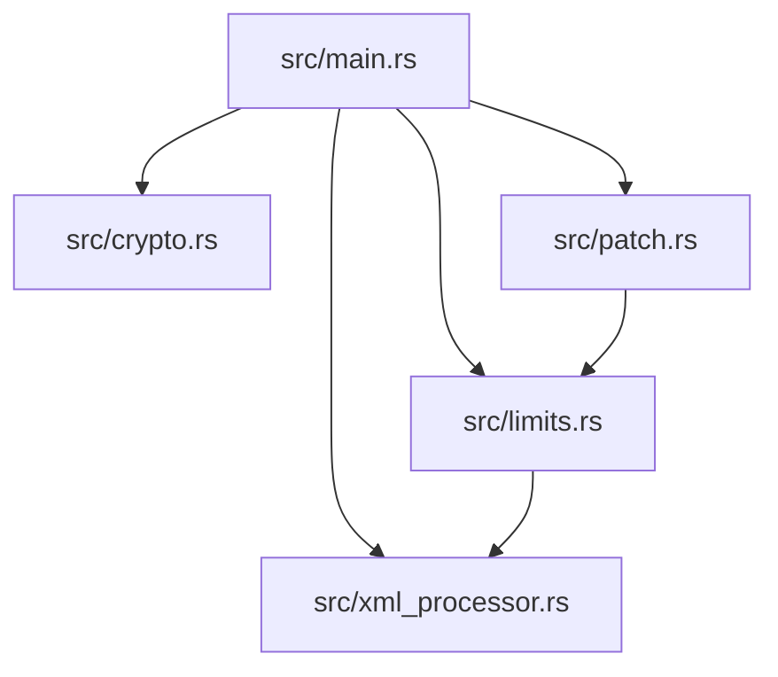

# ThrottleGear Source Code Architecture

This document provides a detailed breakdown of each source file inside the `src/` directory.

---

## Codebase Overview

The ThrottleGear utility is structured as a modular command-line tool written in Rust. It does not pull in external crates for parsing XML or handling cryptography. Instead, it relies on standard Rust library functions, direct Foreign Function Interface (FFI) bindings to the system OpenSSL library (`libcrypto`), and a custom recursive-descent XML parser.

Below is the directory map of the source files:

---

## 1. [src/main.rs](https://github.com/mscardovi/throttlegear/blob/master/src/main.rs)

The main entry point of the application. It coordinates the execution flow, processes CLI arguments, reads the input XML, and executes the requested operation (encryption, decryption, C struct generation, or kernel patch generation).

### Key Responsibilities
- **Command Line Parsing**: Parses options like `-i` (input), `-o` (output), `-c` (print C struct), `-P` (generate patch), `-p` (profile), and other parameters.
- **Dynamic Output Derivation**: Uses `derive_output_filename` to automatically name output files based on whether encryption or decryption is taking place when `-o` is passed without a value.
- **Workflow Coordination**:
  - Validates constraints (e.g., username/email requirements for patches).
  - Reads input XML files.
  - Resolves decryption keys and IVs using attributes from the XML root.
  - Decrypts or encrypts files and writes the output.
  - Invokes `limits` and `patch` modules to output kernel quirks.

---

## 2. [src/crypto.rs](https://github.com/mscardovi/throttlegear/blob/master/src/crypto.rs)

Provides low-level cryptographic utilities. It implements key/IV parameter derivation, custom Base64 encoding/decoding, and binds directly to the OpenSSL EVP cipher APIs.

### Key Components
- **FFI Declarations**: Binds `libcrypto` functions (`EVP_CIPHER_CTX_new`, `EVP_CIPHER_CTX_free`, `EVP_aes_256_cbc`, `EVP_DecryptInit_ex`, etc.) inside an `unsafe extern "C"` block.
- **`get_key_and_iv`**: Implements key derivation (32-byte key incorporating `ModelName` and `Type`) and IV derivation (16-byte IV from little-endian representation of the `Version` string components).
- **`decrypt_aes_256_cbc` / `encrypt_aes_256_cbc`**: Handles buffer setup, padding context management, and EVP encryption/decryption cycles.
- **`base64_encode` / `base64_decode`**: A dependency-free Base64 utility to encode/decode ciphertext blocks stored inside `<CipherValue>` tags.

---

## 3. [src/xml_processor.rs](https://github.com/mscardovi/throttlegear/blob/master/src/xml_processor.rs)

A lightweight XML parser and serializer implemented from scratch. It models the XML structure in memory and performs decryption or encryption on specific child elements.

### Key Components
- **`XmlElement`**: A struct representing an XML tag, storing its name, a `HashMap` of attributes, and a list of children.
- **`XmlNode`**: An enum representing either an element (`XmlNode::Element`) or text content (`XmlNode::Text`).
- **`parse_xml_str`**: A recursive-descent parser that consumes a string and constructs an `XmlElement` tree. It handles tags, attributes, escaping, and text nodes.
- **`serialize_xml`**: Reconstructs the XML string representation from an `XmlElement` tree with pretty indentation, preserving formatting and namespaces exactly.
- **`decrypt_xml` / `encrypt_xml`**: Walks the XML tree to locate `<EncryptedData>` tags, decodes/decrypts (or encrypts/encodes) the content, and replaces nodes inline.

---

## 4. [src/limits.rs](https://github.com/mscardovi/throttlegear/blob/master/src/limits.rs)

Extracts power and thermal limits from the decrypted XML structure and generates the C struct formatting required for inclusion in the Linux kernel.

### Key Components
- **`generate_c_struct`**: Coordinates the extraction of limits for a specific profile (e.g. CPU/GPU settings) and structures it into a format compatible with `struct power_data` in the driver.
- **Intel & AMD Limits Extraction**:
  - Handles Intel architecture limits like `PL1` and `PL2` from CPU plugin configurations.
  - Handles AMD limits like `STAPM` and `PPTLimit` from CPU plugin configurations.
  - Parses GPU limits like `DynamicBoost`, `NBThermalTarget`, and `TGPItem`.
- **Formatting Helpers**: Outputs formatted structures containing `ac_data` and `dc_data` parameters like base TGP, temp targets, and fan curve requirements.

---

## 5. [src/patch.rs](https://github.com/mscardovi/throttlegear/blob/master/src/patch.rs)

Automates the creation of a Linux platform device quirk patch by downloading the mainline `asus-armoury.h` file, inserting the new device structure, and formatting a git-compliant patch file.

### Key Components
- **`generate_patch_file`**: Matches the derived device limits against the mainline `asus-armoury.h` header, inserting the quirk entry alphabetically by board name.
- **`parse_c_struct_limits`**: Parses existing C struct entries inside the header to detect if a matching quirk for the board already exists and reports differences.
- **`generate_unified_diff`**: Generates a clean unified diff patch file that can be applied to the Linux kernel repository.
- **Patch Formatting**: Configures headers, author attribution (username/email), sign-off trailers, and stats to match LKML submission standards.
